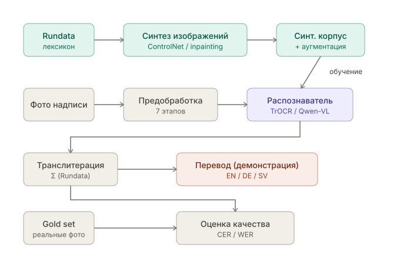

# RUNIC-OCR — распознавание древнегерманских рунических надписей

Код, данные и материалы магистерской ВКР
**«Автоматическое распознавание, перевод и анализ древнегерманских рунических текстов»**
(НИУ ВШЭ, факультет гуманитарных наук, ОП «Компьютерная лингвистика», 2026).

- **Автор:** Перфильев Антон Юрьевич, группа МКЛНГ241
- **Научный руководитель:** Макаров Илья Андреевич, PhD, факультет компьютерных наук НИУ ВШЭ
- **Текст работы:** [`thesis/VKR_Perfilev_2026.pdf`](thesis/VKR_Perfilev_2026.pdf) · [страница ВКР на hse.ru](https://www.hse.ru/edu/vkr/1165807526)
- **Презентация защиты:** [`thesis/defense/VKR_defense.pptx`](thesis/defense/VKR_defense.pptx)

> *English summary.* End-to-end OCR of Scandinavian runic inscriptions: photo → Latin transliteration
> (Rundata convention). Models are trained **only on synthetic images** (Stable Diffusion 3 + ControlNet Canny)
> and evaluated on a real gold set of 113 lines. TrOCR (LoRA) is compared with Qwen-VL models (QLoRA).
> Best result: **Qwen2.5-VL-7B, CER 54.27 %** on real photos (zero-shot is > 100 %). The main error source
> is the synthetic-to-real domain gap (+32…+42 pp); TrOCR overfits the synthetic data and collapses on real photos.

---

## Суть работы

Размеченного корпуса «фото надписи ↔ транслитерация» для германских рун не существует, поэтому сигналы
разделены: **обучение — только на синтетике**, **оценка — только на реальном золотом множестве**.



1. **Лексикон.** Транслитерации из Rundata / Runor и сводки *Gamla runor* (Christer Hamp) токенизируются,
   фильтруются по алфавиту Σ (33 знака конвенции Rundata), слова с частотой ≥ 2 сэмплируются с температурой 0,7
   и собираются во фразы из 1–4 слов с разделителем `᛬` (U+16EC).
2. **Рендер.** Строка переводится в руны обратимой таблицей (`transliteration → runes → transliteration` проверяется
   на всём корпусе) и отрисовывается шрифтом Noto Sans Runic на холсте 1024×1024.
3. **Синтез.** Stable Diffusion 3 Medium + ControlNet `InstantX/SD3-Controlnet-Canny`
   (Canny 50/150, conditioning scale 0,65, 28 шагов, CFG 7,0); inpainting-режим используется как геометрически
   точный вариант. Сравнение модальностей ControlNet — в [`results/figures/`](results/figures/).
4. **Распознавание.** Сквозные (end-to-end) модели без этапа детекции:
   TrOCR-BASE/LARGE + LoRA и Qwen2-VL / Qwen2.5-VL / Qwen3-VL + QLoRA (4-bit NF4).
   Выход — латинская транслитерация, поэтому расширять токенизатор рунами не нужно.
5. **Оценка.** CER (основная), WER, NED, sequence accuracy, 95 % бутстрэп-интервалы на gold set.
   Слова gold set исключены из обучающей синтетики (контроль лексической утечки).
6. **Перевод (демонстрация).** Транслитерация может подаваться в LLM-модуль перевода из смежной работы
   ([dimapchik/runic_ai](https://github.com/dimapchik/runic_ai)); собственным вкладом этой ВКР он не является.

## Результаты

Синтетика: 4 647 изображений (train 4 432 / val 215 после удаления 38 строк, пересекающихся с gold set).
Gold set: 113 строк реальных надписей. Одна NVIDIA T4, смешанная точность.

**После дообучения на синтетике** (таблица 5.4 ВКР), %:

| Модель | CER synth val | **CER gold** (95 % ДИ) | WER gold | SeqAcc | Δ CER (gold − synth) |
|---|---:|---:|---:|---:|---:|
| TrOCR-BASE + LoRA | 28,40 | 93,75 (93,0–95,1) | 100,0 | 0,0 | +65,35 |
| TrOCR-LARGE + LoRA | 14,27 | 95,05 (93,9–96,1) | 100,0 | 0,0 | +80,78 |
| Qwen2-VL-2B + QLoRA | 41,70 | 73,97 (70,5–77,5) | 98,24 | 0,88 | +32,27 |
| **Qwen2.5-VL-7B + QLoRA** | **12,03** | **54,27 (48,0–61,3)** | **81,18** | **8,85** | +42,24 |
| Qwen3-VL-2B + QLoRA | 33,39 | 73,55 (69,9–77,5) | 97,65 | 1,77 | +40,16 |
| Qwen3-VL-8B + QLoRA | 34,69 | 67,86 (62,2–73,6) | 95,29 | 0,88 | +33,17 |

**Без адаптации (zero-shot)** все модели несостоятельны: CER на gold set от 100,53 % (TrOCR-LARGE)
до 724,55 % (Qwen2-VL-2B). Полная таблица — [`results/metrics/summary.csv`](results/metrics/summary.csv).

Выводы:
- задача недоступна без адаптации; дообучение на синтетике снижает CER в разы, но порог практической
  применимости (CER < 20 %) не достигнут;
- главный источник ошибки — синтетически-реальный доменный сдвиг (+32…+42 п. п.), а не ёмкость модели;
- TrOCR хорошо подгоняется к синтетике, но на реальных фото выдаёт почти всегда один токен (`ek`),
  а мультимодальный прайор Qwen-VL переносится лучше;
- типичные ошибки лучшей модели: замены близких рун (k/g, t/þ, b/þ, i/e, u/o, R/r, m/n) и откат к частотным
  `ek` / `alu` на коротких архаичных надписях. Все 113 предсказаний —
  [`results/predictions/qwen25vl-7b_finetuned_gold.csv`](results/predictions/qwen25vl-7b_finetuned_gold.csv).

## Структура репозитория

```
RUNIC-OCR/
├── thesis/
│   ├── VKR_Perfilev_2026.pdf          # финальный текст ВКР (03.06.2026)
│   ├── latex/                         # LaTeX-исходник (черновик глав 1–4 от 02.06), refs.bib, схема конвейера (TikZ)
│   └── defense/VKR_defense.pptx       # презентация защиты
├── data/
│   ├── gold_set/                      # 113 реальных строк: изображения + real_corpus.csv (эталонная транслитерация)
│   ├── synthetic/                     # labels_runic.csv (4 647 меток) + примеры изображений
│   └── sources/                       # выгрузки баз для лексикона (Gamla runor, runer.ku.dk), шрифт Noto Sans Runic
├── src/
│   ├── runic_ocr_experiments.py       # единый стенд: данные, TrOCR/Qwen-VL, обучение, оценка, абляция
│   ├── runic_transliteration.py       # руны (Unicode) ↔ транслитерация Rundata
│   ├── synth_dataset_generation.py    # ранний генератор синтетики (SD inpainting)
│   ├── update_corpus.py               # пополнение real_corpus.csv новыми изображениями
│   └── parser_runes.py                # парсер базы RuneS
├── notebooks/
│   ├── 01_data_collection/            # парсинг баз, нормализация фото, проверка gold set
│   ├── 02_synthesis/                  # SD3 + ControlNet Canny (финал), Depth, сравнение модальностей ControlNet
│   └── 03_training_eval/              # эксперименты TrOCR / Qwen-VL (Kaggle, с выводами)
├── results/
│   ├── metrics/                       # сводные метрики всех моделей
│   ├── predictions/                   # предсказания на gold set
│   └── figures/                       # схема конвейера, сравнение ControlNet
└── requirements.txt
```

## Запуск

Эксперименты выполнялись в Kaggle / Colab (одна GPU ~16 ГБ). Основной сценарий —
ноутбук [`notebooks/03_training_eval/experiments_qwen_trocr.ipynb`](notebooks/03_training_eval/experiments_qwen_trocr.ipynb)
или тот же код в виде модуля [`src/runic_ocr_experiments.py`](src/runic_ocr_experiments.py):

```bash
pip install -r requirements.txt
```

```python
from runic_ocr_experiments import prepare_data, run_train, run_eval
synth_df, gold_df = prepare_data()   # пути к синтетике и gold set задаются в GlobalConfig
run_train("qwen25vl-7b")             # ключи моделей: trocr-base, trocr-large, qwen2vl-2b, qwen25vl-7b, qwen3vl-2b, qwen3vl-8b, ...
run_eval("qwen25vl-7b")              # CER / WER / NED / SeqAcc + бутстрэп-ДИ на gold set
```

Генерация синтетики — [`notebooks/02_synthesis/final_synth_sd3_controlnet_canny.ipynb`](notebooks/02_synthesis/final_synth_sd3_controlnet_canny.ipynb)
(нужен доступ к `stabilityai/stable-diffusion-3-medium-diffusers` и HF-токен в переменной окружения / секретах Kaggle).

## Где лежат большие артефакты

В git не помещаются веса моделей и полный синтетический корпус (~11 ГБ). Они хранятся здесь:

| Артефакт | Где |
|---|---|
| Лучшие QLoRA-адаптеры Qwen2.5-VL-7B / Qwen3-VL-8B / Qwen3-VL-2B | **публично:** [HF `AntoniusPerf/runic-ocr-qwen-vl-lora`](https://huggingface.co/AntoniusPerf/runic-ocr-qwen-vl-lora) |
| Чекпойнты TrOCR (LoRA) | HF: `AntoniusPerf/trocr-checkpoints` (приватно) |
| Синтетический корпус ВКР (SD3 + Canny, 4 647 изобр.) | Kaggle: `zhopa228/synth-final` (приватно) |
| Gold set | Kaggle: `zhopa228/val-dataset` (копия — в `data/gold_set/`) |
| Синтетика SD3 + ControlNet Depth (продолжение после защиты) | HF dataset: `AntoniusPerf/runic-synth-sd3-depth` |
| Исходные выгрузки баз | Kaggle: `zhopa228/runic-inscriptions`, `zhopa228/runer-ku`, `zhopa228/christerhamp-gamla-runor-with-filenames` |

## Источники данных

- [Samnordisk runtextdatabas (Rundata)](https://www.runforum.nordiska.uu.se/srd/), Уппсальский университет
- [Söktjänsten Runor](https://app.raa.se/open/runor/), Riksantikvarieämbetet
- [RuneS — Runic Writing in the Germanic Languages](https://www.runesdb.de/)
- [Danske Runeindskrifter](https://runer.ku.dk/), *Gamla runor* (Christer Hamp)

Права на тексты и фотографии принадлежат соответствующим базам и музеям; данные приведены для исследовательских целей.

## Цитирование

```bibtex
@mastersthesis{perfilev2026runic,
  author = {Перфильев, Антон Юрьевич},
  title  = {Автоматическое распознавание, перевод и анализ древнегерманских рунических текстов},
  school = {НИУ «Высшая школа экономики»},
  year   = {2026},
  url    = {https://github.com/kekys778/RUNIC-OCR}
}
```

Код распространяется по лицензии MIT (см. [`LICENSE`](LICENSE)).
