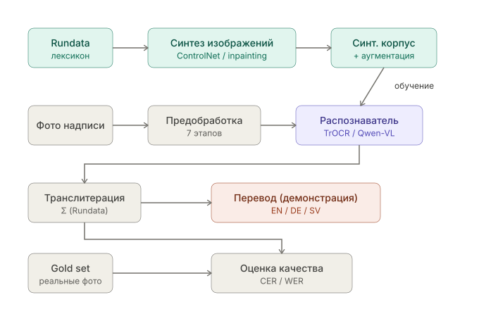
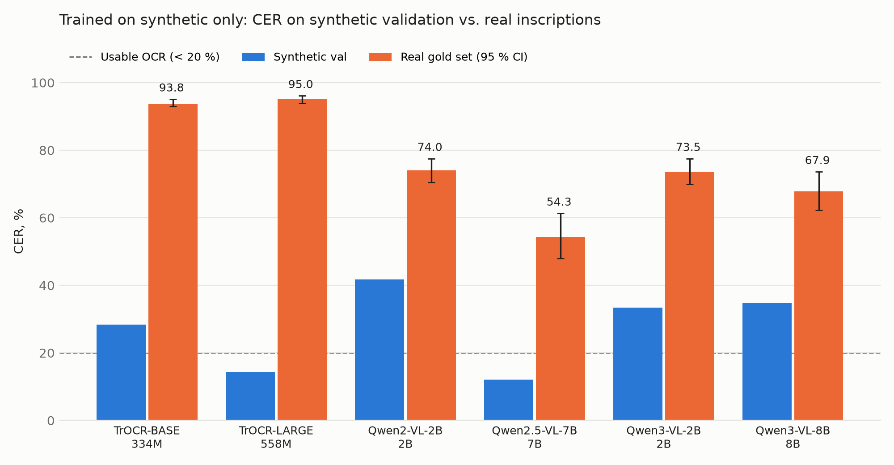

# RUNIC-OCR — reading Germanic runic inscriptions from photos

[](https://github.com/kekys778/RUNIC-OCR/actions/workflows/ci.yml)
[](LICENSE)
[](pyproject.toml)
[](https://huggingface.co/AntoniusPerf/runic-ocr-qwen-vl-lora)
[](https://github.com/astral-sh/ruff)

**English** · [Русский](README.ru.md)

End-to-end OCR of Scandinavian runic inscriptions: **photo → Latin transliteration** in the Rundata
convention. No labelled corpus of "inscription photo ↔ transliteration" exists, so the models are
trained **only on synthetic images** (Stable Diffusion 3 + ControlNet Canny) and evaluated **only on
real photos** (a hand-built gold set of 113 lines).

Code, data and results of the master's thesis *"Automatic recognition, translation and analysis of
ancient Germanic runic texts"* (HSE University, MA "Computational Linguistics", 2026),
Anton Perfilev; supervisor Ilya Makarov, PhD.
[Thesis PDF](thesis/VKR_Perfilev_2026.pdf) · [HSE page](https://www.hse.ru/edu/vkr/1165807526) ·
[Defense slides](thesis/defense/VKR_defense.pptx)



## Key results

| | |
|---|---|
| **Best model** | Qwen2.5-VL-7B + QLoRA, **CER 54.3 %** on real photos (95 % CI 48.0–61.3) |
| **Zero-shot** | every model is above 100 % CER, so the task is out of reach without adaptation |
| **Main error source** | the synthetic-to-real domain gap: +32 to +42 pp CER between synthetic val and real photos |
| **TrOCR vs. VLMs** | TrOCR fits the synthetic data (14 % CER) but collapses on real photos; Qwen-VL transfers better |



<details>
<summary>Full table (thesis table 5.4, %)</summary>

| Model | CER synth val | **CER gold** (95 % CI) | WER gold | SeqAcc | Δ CER (gold − synth) |
|---|---:|---:|---:|---:|---:|
| TrOCR-BASE + LoRA | 28.40 | 93.75 (93.0–95.1) | 100.0 | 0.0 | +65.35 |
| TrOCR-LARGE + LoRA | 14.27 | 95.05 (93.9–96.1) | 100.0 | 0.0 | +80.78 |
| Qwen2-VL-2B + QLoRA | 41.70 | 73.97 (70.5–77.5) | 98.24 | 0.88 | +32.27 |
| **Qwen2.5-VL-7B + QLoRA** | **12.03** | **54.27 (48.0–61.3)** | **81.18** | **8.85** | +42.24 |
| Qwen3-VL-2B + QLoRA | 33.39 | 73.55 (69.9–77.5) | 97.65 | 1.77 | +40.16 |
| Qwen3-VL-8B + QLoRA | 34.69 | 67.86 (62.2–73.6) | 95.29 | 0.88 | +33.17 |

Zero-shot rows and CIs: [`results/metrics/summary.csv`](results/metrics/summary.csv).
All 113 predictions of the best model: [`results/predictions/qwen25vl-7b_finetuned_gold.csv`](results/predictions/qwen25vl-7b_finetuned_gold.csv).
</details>

**Post-thesis error analysis** ([report](results/analysis/qwen25vl-7b_finetuned/REPORT.md)): the 113 gold lines come
from only 28 inscriptions, so the honest 95 % CI of the best model is **42.0–70.5 %** (resampling inscriptions,
not lines). 71 % of its errors are deletions, i.e. too-short outputs. Only 27 % are substitutions between similar runes,
and it falls back to frequent formulas (`ek` on 18 lines, `alu` on 7). Follow-up experiments that run on Kaggle
without any setup are in [`notebooks/04_further_work/`](notebooks/04_further_work/README.md).

## Method in five steps

1. **Lexicon.** Transliterations from Rundata/Runor, RuneS, Danske Runeindskrifter and *Gamla runor*
   are tokenized and filtered by the 33-symbol Rundata alphabet. Words with frequency ≥ 2 are sampled
   (temperature 0.7) into 1–4-word phrases joined by the `᛬` divider.
2. **Rendering.** Phrases are mapped to Unicode runes by a reversible table (`translit → runes → translit`
   is verified on the whole lexicon) and rendered with Noto Sans Runic on a 1024 × 1024 canvas.
3. **Synthesis.** SD3 Medium + `InstantX/SD3-Controlnet-Canny` (Canny 50/150, conditioning scale 0.65,
   28 steps, CFG 7.0) produces 4,647 stone-carving images. Canny was chosen over five other
   ControlNet modalities ([comparison](notebooks/02_synthesis/01_controlnet_modalities_comparison.ipynb)).
4. **Recognition.** End-to-end models with no detection stage: TrOCR-BASE/LARGE + LoRA and
   Qwen2-VL / Qwen2.5-VL / Qwen3-VL + QLoRA (4-bit NF4). The output is Latin transliteration, so no
   tokenizer extension is needed.
5. **Evaluation.** CER (primary), WER, NED and sequence accuracy, with bootstrap 95 % CIs on the gold set.
   Gold-set words are removed from the synthetic training data to control lexical leakage.

## Repository layout

```
RUNIC-OCR/
├── notebooks/                  # the research story, in order; see notebooks/README.md
│   ├── 01_data_collection/     # runer.ku.dk scraper, gold-set photo normalization
│   ├── 02_synthesis/           # ControlNet comparison, SD3 + Canny (final), SD3 + Depth
│   ├── 03_training_eval/       # TrOCR / Qwen-VL training and evaluation
│   └── 04_further_work/        # post-thesis experiments, fire-and-forget on Kaggle
├── src/                        # reusable Python modules
│   ├── runic_ocr_experiments.py    # unified harness: data, models, training, metrics, ablation
│   ├── runic_transliteration.py    # Unicode runes <-> Rundata transliteration
│   ├── runic_eval.py               # torch-free metrics, inscription-level bootstrap, grouped k-fold
│   ├── runic_vlm.py / runic_kaggle.py / runic_reports.py  # GPU runner, Kaggle helpers, reports
│   ├── synth_dataset_generation.py # early SDXL-inpainting generator
│   ├── update_corpus.py            # append new images to real_corpus.csv
│   └── parser_runes.py             # RuneS database scraper
├── data/                       # gold set (113 real lines), synthetic labels + samples, sources; see data/README.md
├── results/                    # metrics, predictions, figures
├── scripts/                    # plot_results.py (figure), analyze_predictions.py (error analysis, CPU)
├── tests/                      # unit tests (CPU-only)
└── thesis/                     # PDF, LaTeX sources, defense slides
```

## Getting started

Experiments were run on Kaggle/Colab with one ~16 GB GPU (NVIDIA T4).

```bash
git clone https://github.com/kekys778/RUNIC-OCR.git && cd RUNIC-OCR
pip install -r requirements.txt          # full GPU stack (torch, transformers, diffusers, ...)
pip install -r requirements-dev.txt      # lightweight: lint + tests + plotting
pytest                                   # CPU-only unit tests
```

Train and evaluate a model with the unified harness. It is the same code as
[`notebooks/03_training_eval/01_experiments_trocr_qwen.ipynb`](notebooks/03_training_eval/01_experiments_trocr_qwen.ipynb):

```python
import sys

sys.path.append("src")
from runic_ocr_experiments import CFG, prepare_data, run_eval, run_train

CFG.SYNTH_ZIP = "/path/to/synthetic_images"  # folder or zip
CFG.GOLD_SOURCE = "data/gold_set"  # 113 real lines + real_corpus.csv
synth_df, gold_df = prepare_data()

run_train("qwen25vl-7b", synth_df=synth_df, gold_df=gold_df)
# CER / WER / NED / SeqAcc + bootstrap CI on the gold set
run_eval("qwen25vl-7b", gold_df=gold_df, synth_df=synth_df)
```

Model keys: `trocr-base`, `trocr-large`, `qwen2vl-2b`, `qwen25vl-7b`, `qwen3vl-2b`, `qwen3vl-8b`.
To evaluate a published adapter without training, download it from
[Hugging Face](https://huggingface.co/AntoniusPerf/runic-ocr-qwen-vl-lora) and pass its folder as
`run_eval(..., ckpt_dir=...)`.

The synthetic corpus is generated by
[`notebooks/02_synthesis/02_synth_sd3_canny_final.ipynb`](notebooks/02_synthesis/02_synth_sd3_canny_final.ipynb).
It needs access to `stabilityai/stable-diffusion-3-medium-diffusers`. The `HF_TOKEN` secret is read from an environment variable or Kaggle/Colab secrets and is never stored in notebooks.

## Large artifacts

Model weights and the full synthetic corpus (~11 GB) are not stored in git:

| Artifact | Location |
|---|---|
| Best QLoRA adapters (Qwen2.5-VL-7B / Qwen3-VL-8B / Qwen3-VL-2B) | **public:** [HF `AntoniusPerf/runic-ocr-qwen-vl-lora`](https://huggingface.co/AntoniusPerf/runic-ocr-qwen-vl-lora) |
| TrOCR checkpoints (LoRA) | HF `AntoniusPerf/trocr-checkpoints` (private) |
| Thesis synthetic corpus (SD3 + Canny, 4,647 images) | Kaggle `zhopa228/synth-final` (private) |
| Gold set | Kaggle `zhopa228/val-dataset` (copy in [`data/gold_set/`](data/gold_set/)) |
| SD3 + Depth synthetic data (post-defense) | HF dataset `AntoniusPerf/runic-synth-sd3-depth` |
| Raw database exports | Kaggle `zhopa228/runic-inscriptions`, `zhopa228/runer-ku`, `zhopa228/christerhamp-gamla-runor-with-filenames` |

## Data sources

- [Samnordisk runtextdatabas (Rundata)](https://www.runforum.nordiska.uu.se/srd/), Uppsala University
- [Söktjänsten Runor](https://app.raa.se/open/runor/), Swedish National Heritage Board
- [RuneS — Runic Writing in the Germanic Languages](https://www.runesdb.de/)
- [Danske Runeindskrifter](https://runer.ku.dk/) and *Gamla runor* (Christer Hamp)

Rights to texts and photos belong to the respective databases and museums; the data are used for research.
The translation demo uses the LLM module from the related project
[dimapchik/runic_ai](https://github.com/dimapchik/runic_ai), which is not a contribution of this thesis.

## Citation

```bibtex
@mastersthesis{perfilev2026runic,
  author = {Perfilev, Anton},
  title  = {Automatic Recognition, Translation and Analysis of Ancient Germanic Runic Texts},
  school = {HSE University},
  year   = {2026},
  url    = {https://github.com/kekys778/RUNIC-OCR}
}
```

See also [`CITATION.cff`](CITATION.cff). Code is released under the MIT license ([`LICENSE`](LICENSE)).
