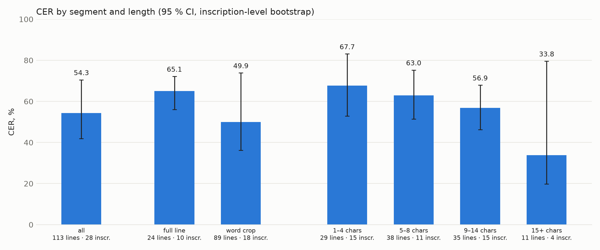
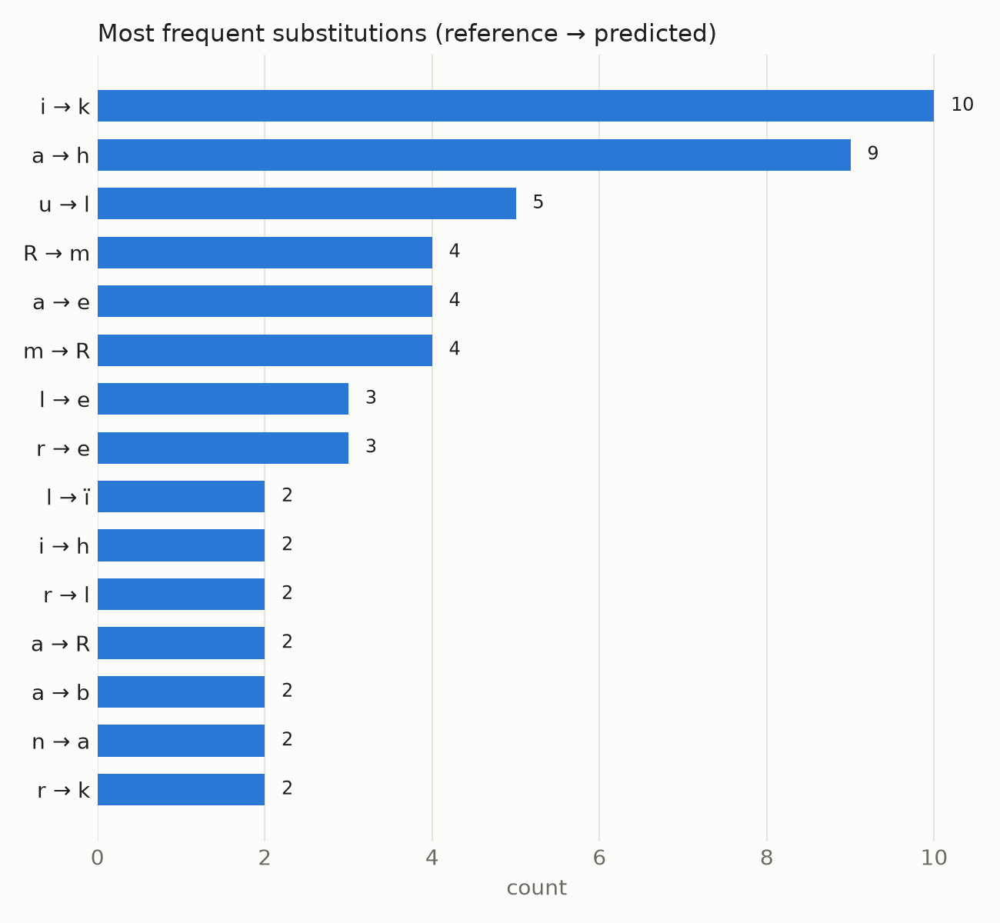
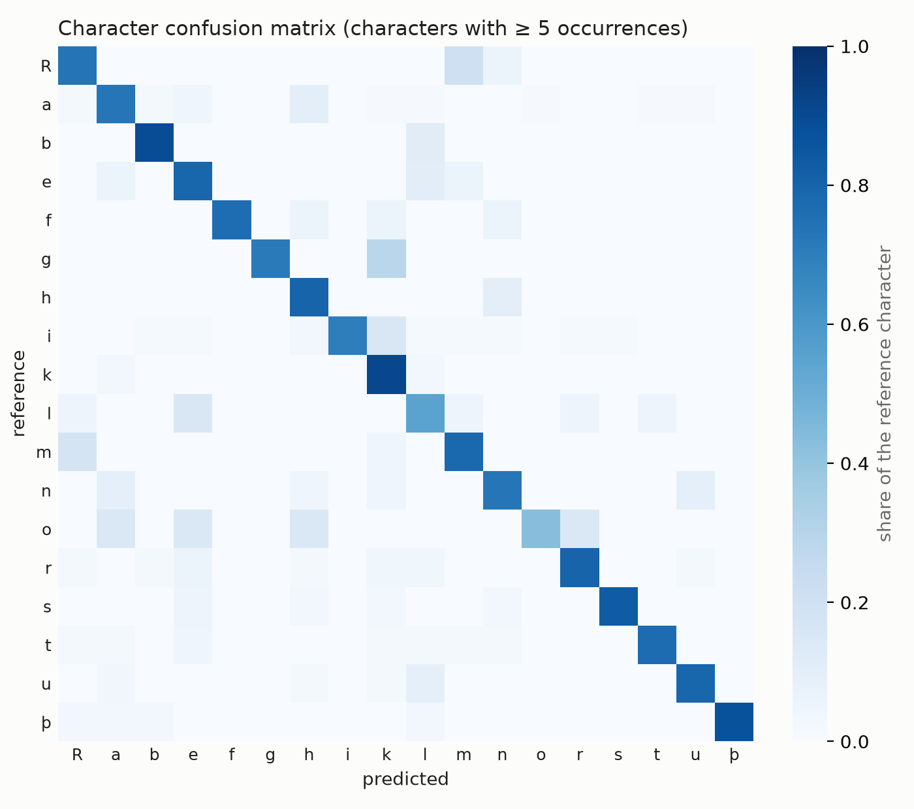

# Error analysis — `qwen25vl-7b_finetuned_gold.csv`

Generated by `scripts/analyze_predictions.py` (CPU, from saved predictions).

| | value |
|---|---|
| CER / WER / NED / SeqAcc | 54.27 / 81.18 / 59.37 / 8.85 % |
| Lines / inscriptions | 113 / 28 |
| 95 % CI, line bootstrap (thesis protocol) | 48.0 – 61.3 % |
| **95 % CI, inscription bootstrap** | **42.0 – 70.5 %** |
| Substitutions / deletions / insertions | 137 / 364 / 14 (27% / 71% / 3%) |

The gold set's 113 lines come from only 28 inscriptions, and many lines are
overlapping crops of one photo. Resampling whole inscriptions gives the honest uncertainty.

**Top substitutions (reference→predicted):** `i→k` (10), `a→h` (9), `u→l` (5), `R→m` (4), `a→e` (4), `m→R` (4), `l→e` (3), `r→e` (3)

**Predictions repeated ≥ 3 times (fallback to frequent words):** `ek` ×18, `alu` ×7, `stain` ×3, `na` ×3

## Versus `qwen3vl-2b_zeroshot_gold.csv`

CER 54.27 % vs. 364.81 %: Δ = -310.54 pp (95 % CI -412.0 … -239.6, inscription-level paired bootstrap), significant.

## CER by segment and length

| subset     |   lines |   inscriptions |   CER |   ci_low |   ci_high |   SeqAcc |
|:-----------|--------:|---------------:|------:|---------:|----------:|---------:|
| all        |     113 |             28 |  54.3 |     42   |      70.5 |      8.8 |
| full line  |      24 |             10 |  65.1 |     56.1 |      72.2 |      0   |
| word crop  |      89 |             18 |  49.9 |     36.3 |      73.9 |     11.2 |
| 1–4 chars  |      29 |             15 |  67.7 |     52.8 |      83.1 |     13.8 |
| 5–8 chars  |      38 |             11 |  63   |     51.4 |      75.3 |     15.8 |
| 9–14 chars |      35 |             15 |  56.9 |     46.2 |      67.9 |      0   |
| 15+ chars  |      11 |              4 |  33.8 |     19.7 |      79.6 |      0   |

